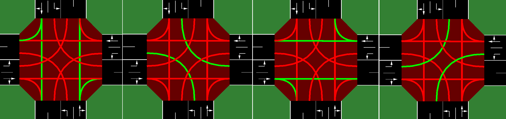

# 대한민국 운전자 특성을 반영한 신호 체계 강화 학습

본 코드는 2024년도 충청북도교육연구정보원 부설 영재교육원 정보 영재 사사과정 B반에서 진행한 연구 "대한민국 운전자 특성을 반영한 신호 체계 강화 학습"의 전체 실험 코드입니다. 강화 학습 환경의 기반이 되는 코드는 [SUMO-RL](https://github.com/LucasAlegre/sumo-rl)을 참고하여 작성하였으며, 시뮬레이션은 SUMO를 사용합니다. 본 연구에서는 SUMO 및 SUMO-RL에서 제공하는 환경을 대한민국 운전자 특성을 반영하도록 수정 및 재구축하여 보다 효과적인 신호 체계 강화 학습 방법을 제시하고자 합니다.

## Install
### SUMO 설치
먼저 SUMO를 설치합니다. [SUMO](https://github.com/eclipse/sumo)(Simulation of Urban MObility)는 도시 이동성의 시뮬레이션을 위한 오픈 소스, 휴대 가능, 모듈 식의 소프트웨어 패키지입니다. [SUMO 공식 설치 방법](https://sumo.dlr.de/docs/Installing/index.html)을 참고하여 사용하는 컴퓨터 운영체제에 적합한 프로그램을 설치합니다. Linux 환경을 권장합니다. Mac OS를 사용하는 경우, [Homebrew]()를 먼저 설치한 후, [Mac OS용 SUMO 설치 가이드](https://sumo.dlr.de/docs/Installing/index.html#macos)를 참고하여 SUMO를 설치해야합니다. 

SUMO를 설치한 후에는 `SUMO_HOME` 환경 변수를 선언해야합니다. Linux의 경우 터미널에서 아래와 같이 선언합니다.
```
echo 'export SUMO_HOME="/usr/share/sumo"' >> ~/.bashrc
source ~/.bashrc
```
Mac OS를 사용하는 유저의 경우, 먼저 터미널에서 `~/.bashrc` 파일을 아래와 같이 열어줍니다.
```
nano ~/.bashrc
```
그리고 파일의 가장 마지막 줄에 아래 한 줄을 적은 후 저장합니다. (`ctrl+O`, `ctrl+X`)를 눌러 저장할 수 있습니다.
```
export SUMO_HOME=/usr/local/opt/sumo/share/sumo
```
위 경로는 일반적으로 `Homebrew`를 사용해 SUMO를 설치했을 때의 경로입니다. 

변수 선언 과정이 잘 되었다면, 아래와 같은 명령어를 터미널에 입력했을 때 경로가 잘 표시되어야 합니다:
```
echo $SUMO_HOME
```

### SUMO-RL 설치
[SUMO-RL](https://github.com/LucasAlegre/sumo-rl)은 SUMO 기반의 `gymnasium` 스타일 강화 학습 환경 라이브러리입니다. `gymnasium`은 강화 학습 분야에서 가장 널리 쓰이는 환경 라이브러리입니다. SUMO-RL은 아래와 같이 간단하게 설치할 수 있습니다.
```
pip install sumo-rl
```

### 추가적인 라이브러리 설치
본 연구의 코드를 돌리기 위해서는 추가적인 라이브러리가 필요합니다. 대표적으로 강화 학습의 SARSA 알고리즘을 구현한 `linear-rl` 라이브러리가 있습니다. 코드 실행에 필요한 모든 라이브러리는 `requirements.txt`에 적어두었으며, 아래와 같은 명령어를 이용해 모두 설치할 수 있습니다.
```
pip install -r requirements.txt
```

## 코드 구조 설명
본 코드는 아래와 같이 구성되어 있습니다.
```
.
├── nets
│   ├── flow_default.rou.xml
│   ├── flow_tailgating.rou.xml
│   └── network.net.xml
├── results
│   └── ...
├── traffic_tail
│   ├── environment.py
│   └── trainer.py
└── visualize.ipynb
```

먼저 `nets` 아래에는 시뮬레이션 환경이 동작하는 지도와 차량의 특성 등을 정의한 파일이 담겨있습니다. 구성 파일은 [SUMO-RL](https://github.com/LucasAlegre/sumo-rl)의 `double` 예제를 변형한 것입니다. `nets/network.net.xml`은 맵을 구성하는 파일이며, `nets/flow_default.rou.xml`은 해당 맵을 통과하는 차량의 특성과 통행량을 정의합니다. `nets/flow_tailgating.rou.xml`은 본 연구에서 변형한 차량의 특성을 담고 있습니다.

다음으로 `traffic_tail`에는 환경 및 강화 학습 코드가 담겨 있습니다. `traffic_tail/environment.py`는 본 연구에서 대한민국 운전자의 특성을 반영하기 위해 변형한 환경의 코드를 정의합니다. 기반이 되는 환경 코드인 [SUMO-RL](https://github.com/LucasAlegre/sumo-rl)의 틀을 대부분 공유하며, 시뮬레이션 단계에서 운전자의 특성을 세밀하게 조정하는 코드가 추가적으로 정의되었습니다. `traffic_tail/trainer.py`는 SARSA 기반 강화 학습 알고리즘을 정의합니다.

시뮬레이션 예제 및 학습 코드는 `visualize.ipynb` 파일에서 직접 실행해 볼 수 있습니다. 실행 결과는 전부 `results` 폴더 아래에 저장됩니다.


## 환경 설명
환경은 [SUMO-RL](https://github.com/LucasAlegre/sumo-rl)의 `SumoEnvironment`를 상속받아 구현되었으며, 아래는 공유하는 기본 틀에 대한 설명입니다.

### 상태(State)
교통 신호를 제어하는 에이전트가 받는 상태는 아래와 같은 벡터입니다.
```
 obs = [phase_one_hot, min_green, lane_1_density,...,lane_n_density, lane_1_queue,...,lane_n_queue]
```
* `phase_one_hot`은 현재 활성화된 녹색 신호 단계를 나타내는 원-핫 인코딩 벡터입니다.
* `min_green`은 현재 단계에서 `min_green`초가 이미 지났는지를 나타내는 이진 변수입니다.
* `lane_i_density`는 들어오는 차선 i에 있는 차량의 수를 차선의 전체 용량으로 나눈 것입니다.
* `lane_i_queue`는 들어오는 차선 i에서 속도가 0.1m/s 이하인 대기중인(queued) 차량의 수를 차선의 전체 용량으로 나눈 것입니다.

### 행동(Action)
매 `delta_time`초마다, 각 교통 신호 에이전트는 다음 녹색 신호 단계 설정을 선택할 수 있습니다.
예를 들어 본 연구에서 다루는 `double` 환경에서는 다음과 같은 녹색 신호 단계 구성에 해당하는 $|A| = 4$개의 이산적 행동이 있습니다:

<p align="center">

</p>

본 연구에서 다루는 환경은 두 개의 신호등이 연달아 있으므로, 각 신호등을 관리하는 에이전트가 따로 존재합니다. 
즉, 두 개의 서로 다른 에이전트에 의해 전체 신호등이 관리되며, 각 에이전트는 $|A| = 4$개의 행동을 각각 선택할 수 있습니다.

중요: 단계 변경이 발생할 때마다 다음 단계는 yellow_time초 동안 지속되는 황색 신호 단계에 의해 선행됩니다.

### 보상(Reward)
기본 보상 함수는 누적 차량 지연(대기) 시간의 변화입니다:
$$
r_{t} = D_{a_{t}} - D_{a_{t+1}}
$$
즉, 보상은 모든 접근 차량의 대기 시간 합계가 이전 시간 단계에 비해 얼마나 변화했는지입니다.

### 차량 특성 변경
변경된 운전자의 특성은 `TailgatingEnv`에 구현되어 있습니다. 
`TailgatingEnv`는 [SUMO-RL](https://github.com/LucasAlegre/sumo-rl)의 `SumoEnvironment`를 상속받습니다. 
시뮬레이션의 각 단계는 `_sumo_step` 함수가 호출되어야 계산됩니다. 

본 연구에서 추가한 세 개의 특성 중 두 개는 각각 `TailgatingEnv`의 `_apply_tailgating` 함수와 `_apply_realistic_impatience_gap`에 구현되어 있습니다.
`_apply_tailgating` 함수는 운전자가 황색 신호에 멈추지 않고 최대한 빨리 통과하려는 운전자의 특성을 반영합니다. 
이러한 특성은 SUMO에서 제공하는 `speed mode`를 통해 구현할 수 있습니다. 해당 함수 및 변수에 대한 설명은 `environment.py`를 참고해주세요.

`_apply_realistic_impatience_gap` 함수는 운전자의 인내심이 줄어듦에 따라 차간 간격을 더 좁히려는 운전자의 심리를 구현합니다. 
해당 함수의 구현 방식과 자세한 설명은 `environment.py`를 참고해주세요.

그 외에도 황색 신호에 교차로를 최대한 통과하려는 운전자의 특성은 `flow_tailgating.rou.xml`에 구현되어 있습니다.
해당 파일의 가장 위에 선언되어 있는 차량에 대한 특성은 다음과 같습니다.
```
<vType id="car" vClass="passenger" color="255,255,255"
		   jmDriveAfterRedTime="1" jmDriveAfterYellowTime="3" jmIgnoreKeepClearTime="2"/>
```
여기서 `jmDriveAfterRedTime`는 적색 신호가 켜진 이후에도 교차로를 통과하기 위해 주행하는 시간(초)을 나타냅니다. 즉, `jmDriveAfterRedTime`가 1이면, 운전자는 적색 신호로 바뀐 1초 후까지도 교차로를 통과하려고 시도합니다. `jmDriveAfterYellowTime`는 마찬가지로 황색 신호가 켜진 이후에도 교차로를 통과하기 위해 주행하는 시간(초)을 나타냅니다. 마지막으로 `jmIgnoreKeepClearTime`는 교차로 한가운데에 차량이 (꼬리물기 등으로 인해) 대기하고 있는 경우, 주행하기 전까지 기다리는 최대 시간을 나타냅니다. 

세 변수 모두 기본 환경에는 모두 $-1$로 설정되어 있습니다. 즉, 운전자는 적색 신호 및 황색 신호가 되기 1초 전까지만 교차로 진입을 시도하며, 
신호가 바뀌기 1초 전에는 차량을 정지합니다. 또한, `jmIgnoreKeepClearTime`가 $-1$인 경우, 운전자는 항상 교차로가 비워지기 전까지 대기합니다. 즉, 청색 신호가 켜진 상태라도 교차로에 차가 대기하는 중이라면 교차로에 진입하지 않습니다.

이 외의 교차로 모델에 대한 자세한 설명은 [SUMO 공식 사이트](https://sumo.dlr.de/docs/Definition_of_Vehicles%2C_Vehicle_Types%2C_and_Routes.html#junction_model_parameters)의 설명을 참고해 주세요.
